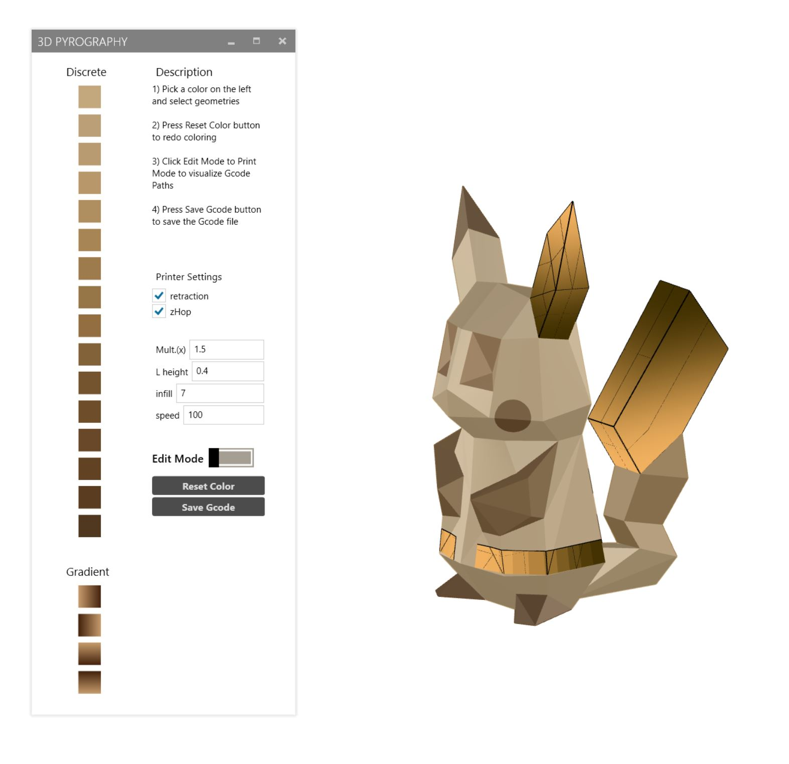

# 3D Pyrography

This is the repository for the 3D Pyrography Interface in Rhino3D environment. 
It also contains pythons script to identify percievable discrete colors.

## Citation
When using or building upon this work in an academic publication, please consider citing as follows:

## Contact
For questions please contact jkpmoon@kaist.ac.kr